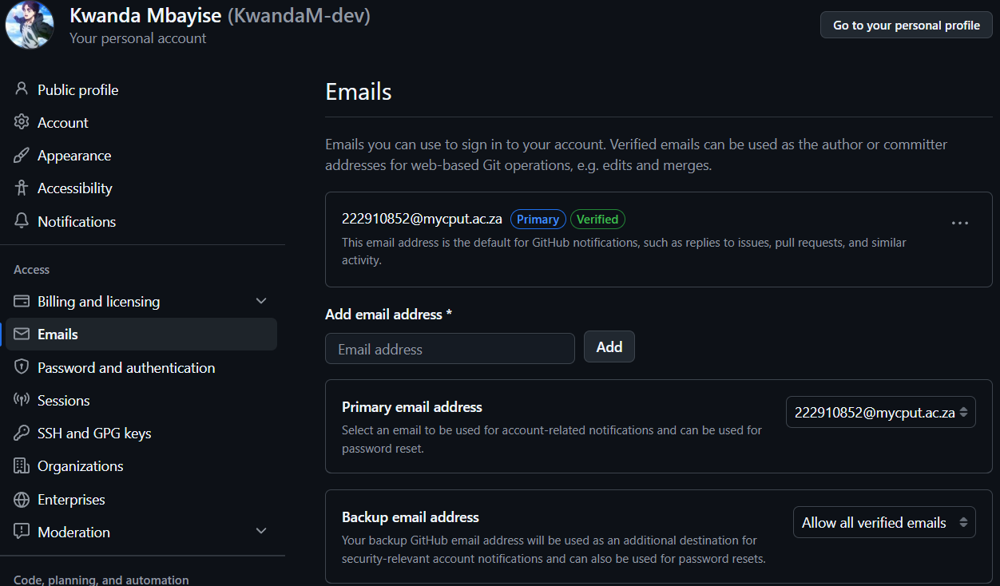

# Github Portfolio

## Github Student Account : Evidence

---

# My Resume

# Kwanda Mbayise
**Information Communication Technology Student**

---

## Contact
- **Phone:** +27-60-594-1128
- **Email:** 222910852@mycput.ac.za
- **Address:** 22 Barrack St, Cape Town, 8000
- **LinkedIn:** Kwanda Mbayise

---

## Profile
Highly motivated and results-driven Applications Development student enrolled at Cape Peninsula University of Technology for the final year enrollment. I possess a strong foundation in core development technologies like Java, Python and SQL, complemented by skills in System Analysis and Design. I pride myself on being organized, collaborative, and a proactive learner. I am eager to contribute my technical knowledge and analytical abilities to a dynamic software or technology environment where I can grow into roles like Development, Engineering and Data.

---

## Education

**Cape Peninsula University of Technology** — 2023 – Present
Diploma in ICT: Applications Development

**Zwelakhe S.S School** — Jan 2021 – Dec 2021
Matriculant — Completed: Mathematics, Geography, Life Science, Agricultural Science, Tourism, Life Orientation and Languages

---

## Work Experience

**Ster Kinekor** — 2025 – Nov
*Multiple Skilled Employee*

- Provided Customer Service Support by tackling daily queries and solving technical issues from hardware to software.
- Promoted company products and encouraged customers to purchase certain products.
- Kept track of customer data for moviegoers across different time frames and screenings.
- Responsible for preparing and hosting screening events held before big movie releases.

---

## Skills

- **Programming Languages:** Java, Python & SQL
- **Tools & Technologies:** IntelliJ, Eclipse, MySQL Workbench, Git & GitHub
- **Concepts & Methods:** Data Structures & Algorithms, OOP, System Design, Java Swing, SDLC, Networking and Communications
- **Database:** Relational Databases, Database Design & DBMS
- **Soft Skills:** Problem Solving, Collaboration and Communication

---

## Languages
- English
- Xhosa

---

## References

**VZ Ngcaba** — Ster-Kinekor / Supervisor
- Phone: +27 81-492-9720
- Email: velaziyandangcaba@gmail.com

**OJ Mtolo** — Mentor
- Phone: +27 79-510-9767
- Email: ongeziwejunior6@gmail.com

---
 ### Reflection 

> #### Situation
>> I'm a third year student at CPUT enrolled in Diploma in ICT: Applications Development...

>#### Task 
>> I was tasked with writing my cv using a Markdown Language for my portfolio.

>#### Action 
>> I coded a clean, readable cv.

>#### Results 
>> I successfully coded a clean, readable cv and I gained more understanding on this Markdown Language. 

--- 

---

# Mock Interview Video

<video  src="Mock%20Interview(1).mp4" type="video/mp4" autoplay ></video>

---
### Reflection

> #### Situation
>> I'm a third year student at CPUT enrolled in Diploma in ICT: Applications Development...

>#### Task
>> I was tasked with creating a Mock interview answering questions that are likely to be asked and sharing what I think, then showcase the video with the Markdown Language.

>#### Action
>> The tricky part is that the video in the html file is successfully working, and when trying to embed it in a Markdown Language it didn't want to play .

>#### Results
>> I couldn't get the video on the Markdowm Language file to work.
>

